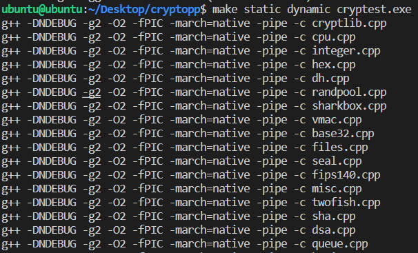
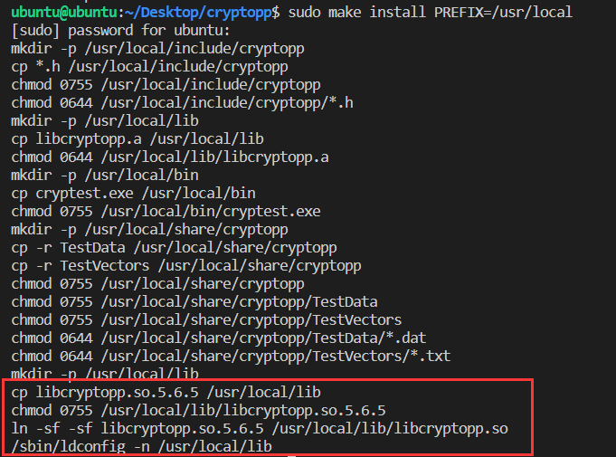
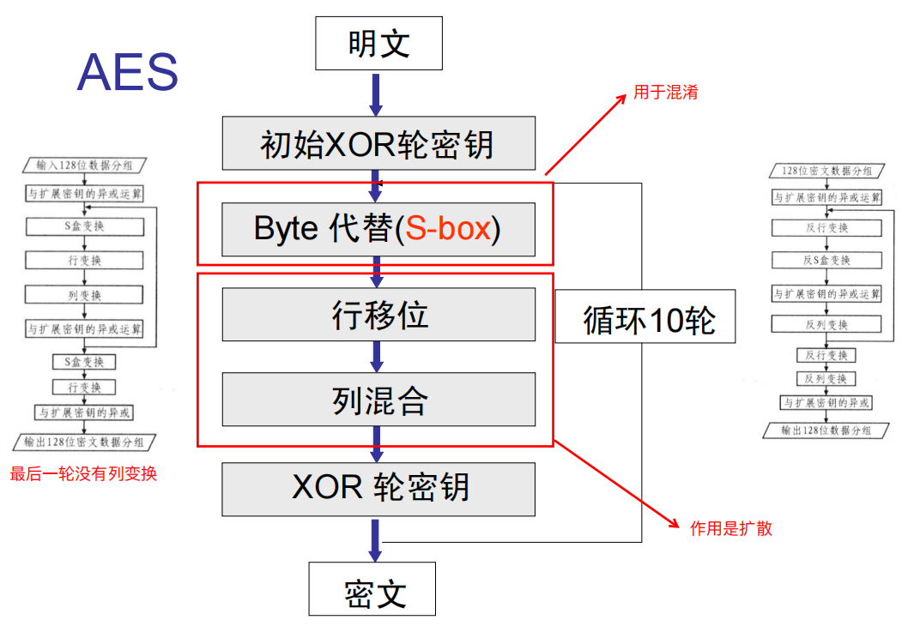
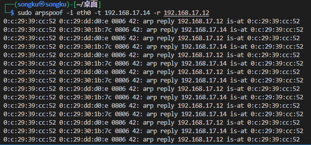
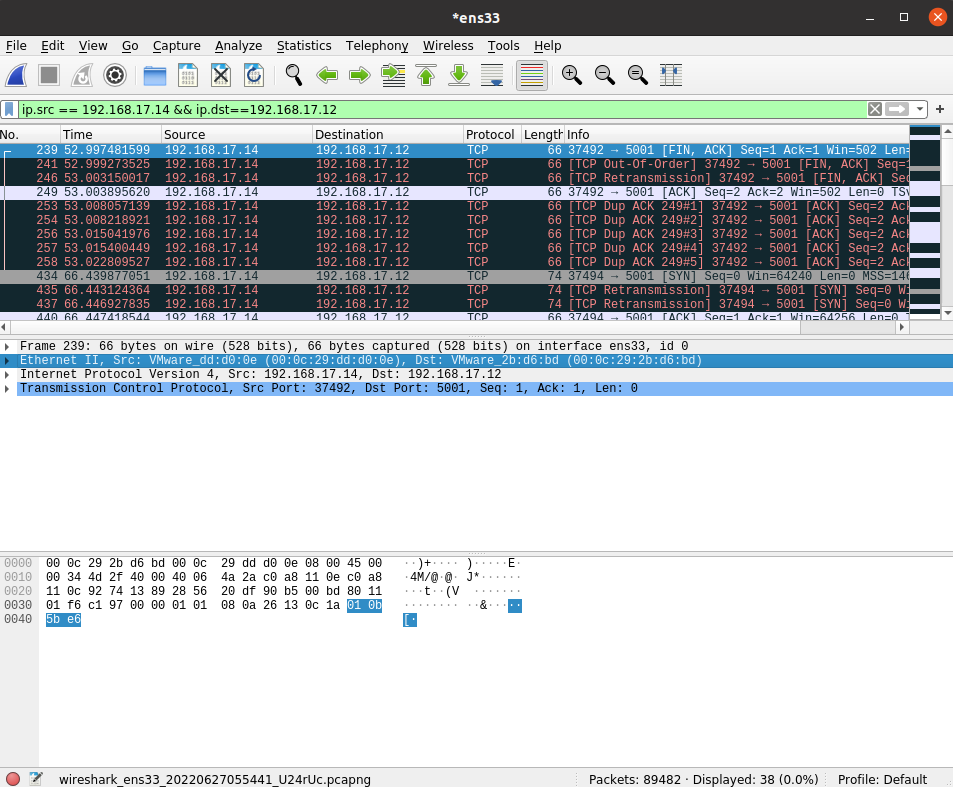
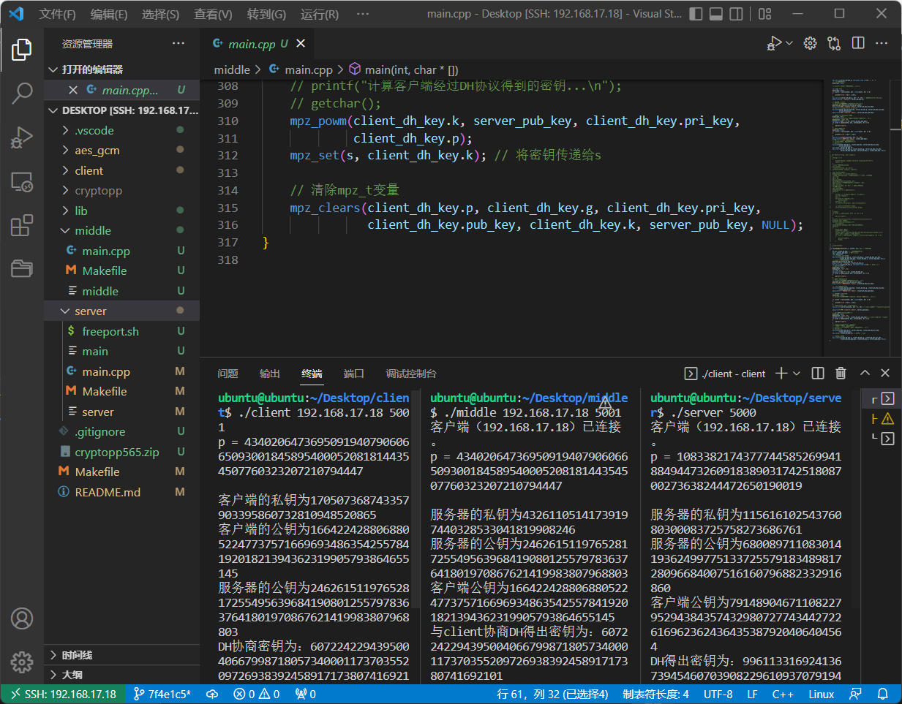

# 网络空间安全课程设计Ⅲ

## 说明

此课程设计由@timwang2001 和 @songku 合作完成，历时2022年6月20日-6月30日。

主要实现了基于DH协议的密钥交换，AES 256 GCM加解密，中间人欺骗攻击截获并篡改数据包和中间人攻击预防。

## 1.要求理解及任务安排

掌握套接口、 安全套接口的基本编程方法；掌握多线程、多机通信机制；完成 C/S 通信原型系统。

熟练运用加密算法，掌握在线加密/解密方法，结合 1）完成 加密数据多机传输的原型系统等；

运用逆向工具分析上述系统运行过程中的网络通信数据，并编写程序

### 实现内容

①Diffie-Hellman 协议的实现，协商出密钥后，客户端加密信息并发送，服务器解密信息。对称加密算法采用AES256-GCM。

②研究中间人攻击，并截获内容。

③预共享密钥。使其能抵御中间人攻击。

中间人捕获数据包，必须得libpcap完成，python还做不了。arp欺骗，监听数据包。

### 参考博客

完整的两个课设博客：

- [C语言模拟D-H密钥交换及中间人攻击](https://blog.csdn.net/qq_35887983/article/details/93595635)
- [针对 Diffie Hellman 协议的中间人攻击与协议改进](https://litcu.cn/posts/84ee37a4/)

其他的一些参考资料：

[Cryptopp AES Wiki](https://www.cryptopp.com/wiki/Advanced_Encryption_Standard) [AES_GCM.zip](https://www.cryptopp.com/w/images/8/8d/AES-GCM-Test.zip)

[Authenticated Encryption](https://www.cryptopp.com/wiki/Authenticated_Encryption)

[Diffie-Hellman - Crypto++ Wiki](https://www.cryptopp.com/wiki/Diffie-Hellman)

[【密码学原理】Diffie-Hellman密钥交换算法与中间人攻击](https://blog.csdn.net/m0_50984266/article/details/108922333)

[【密码学】公钥密码之ElGamal](https://comydream.github.io/2020/12/19/cryptography-dh-elgamal/) （列举了几种中间人攻击的实现方法）

>DH本身没有提供任何身份认证，因此容易遭受中间人攻击。
>
>- 中间人Eve假装自己是Bob与Alice通信 s1=gacmodps1=gacmodp。
>- 中间人Eve假装自己是Alice与Bob通信 s2=gbcmodps2=gbcmodp。
>- Eve将Alice发来的消息用s1s1解密，使用s2s2加密，发送给Bob。
>- Eve将Bob发来的消息用s2s2解密，使用s1s1加密，发送给Alice。
>- Alice和Bob对此一无所知，还无知地以为在与对方通信。
>
>因此，亟需一种能验证通信双方身份的机制（如签名）来防止这类攻击。

## 2.DH协议

[Diffie-Hellman 算法和 MITM 攻击](https://crypto.stackexchange.com/questions/72370/diffie-hellman-algorithm-and-mitm-attack)

DH 协议通常配合公钥体系（ RSA 或者[DSA](https://zhiqiang.org/cs/das-and-ecdsa-rsa.html)）共同使用。协议双方会使用私钥签名，对方可以验证，从而防范中间人攻击。

ubuntu环境安装大数生成的依赖库：`sudo apt-get install libgmp3-dev`

centos7环境安装可能还需要lzip：

1. Download latest epel-release rpm from

   ```bash
   wget https://download-ib01.fedoraproject.org/pub/epel/7/x86_64/Packages/l/lzip-1.19-1.el7.x86_64.rpm
   ```

2. Install epel-release rpm:

   ```bash
   rpm -Uvh lzip-1.19-1.el7.x86_64.rpm
   ```

3. Install lzip rpm package:

   ```bash
   yum install lzip
   ```

```bash
wget https://gmplib.org/download/gmp/gmp-6.2.1.tar.lz
zip -dv gmp-6.2.1.tar.lz
tar xf gmp-6.2.1.tar.lz --lzip
# mkdir gmp
# tar -xvf gmp-6.2.1.tar
cd gmp-6.2.1/
./configure
make
make check
make install
```

DH协议是为了后续传递真正的密钥做准备，DH协议交换得到的并非是后续加密的密钥。

## 3.AES-GCM 256实现加解密

### 1.在ubuntu上安装cryptopp

开发环境使用的是ubuntu 20.04.4

直接实现了AES-GCM的是libcryptopp。也有用libtomcrypt库的。

这里使用libcryptopp

```bash
wget https://sourceforge.net/projects/cryptopp/files/cryptopp/5.6.5/cryptopp565.zip
mkdir cryptopp
unzip -d cryptopp cryptopp565.zip  # 将压缩文件解压至cryptopp文件夹
cd cryptopp
make static dynamic cryptest.exe
```

部分执行截图如下：



生成并安装动态链接库，如下图所示：

```bash
sudo make install PREFIX=/usr/local 
```



至此，就可以正常调用cryptopp库中的相关函数。如果报错`error while loading shared libraries: libcryptopp.so.5.6: cannot open shared object file: No such file or directory`。则需要运行下面的命令，重新创建共享库的链接文件：

```bash
sudo echo "/usr/local/lib" >> /etc/ld.so.conf
ldconfig
```

### 2.cryptopp实现AES-GCM加解密

AES-128，AES-192和AES-256。AES表中的这三个密码中的每一个都使用128位，192位或256位加密密钥对128位数据块进行加密和解密。即密钥位数变化，而数据块位数都是128位。

256位密钥最终具有14个回合。什么是回合？它们对应于多个处理步骤，包括对加密文本进行置换和替换，然后将其转换为加密形式。

AES加密过程的第一步是使用替换表替换信息。第二次转换会更改数据行，而第三次转换列会更改数据行。最后一个转换是使用加密密钥的不同部分在每列上完成的基本互斥XOR过程。加密密钥越长，需要的回合越多。

如果使用libcryptopp库进行加解密，只需要注意传入的key和iv变量即可。一个加解密模型test程序大致如下：

```c++
void test_aes_256_gcm_encrypt_decrypt(string plain)  //测试程序，用的是prng随机生成的key和iv
{
    AutoSeededRandomPool prng;
    HexEncoder encoder(new FileSink(std::cout));

    //SecByteBlock key(AES::DEFAULT_KEYLENGTH); //DEFAULT_KEYLENGTH是16字节，128位的AES密钥
    SecByteBlock key(AES::MAX_KEYLENGTH); //MAX_KEYLENGTH是32字节，256位密钥
    SecByteBlock iv(AES::BLOCKSIZE);

    prng.GenerateBlock(key, key.size());
    prng.GenerateBlock(iv, iv.size());

    std::string cipher, recovered;

    std::cout << "plain text: " << plain << std::endl;

    GCM< AES >::Encryption e;
    e.SetKeyWithIV(key, key.size(), iv);

    StringSource(plain, true, 
        new AuthenticatedEncryptionFilter(e,
            new StringSink(cipher)
        ) // AuthenticatedEncryptionFilter
    ); // StringSource

    std::cout << "cipher text: " << cipher << std::endl;

    GCM< AES >::Decryption d;
    d.SetKeyWithIV(key, key.size(), iv);

    StringSource s(cipher, true, 
        new AuthenticatedDecryptionFilter(d,
            new StringSink(recovered)
        ) // AuthenticatedDecryptionFilter
    ); // StringSource
    std::cout << "recovered text: " << recovered << std::endl;
}
```

编译命令如下：

```bash
g++ aes_gcm.cpp -o aes_gcm -lcryptopp
```


### 3.C++实现AES加解密

参考：[AES-128算法实现（附C++源码）](https://blog.csdn.net/weixin_54891898/article/details/124711932)

https://github.com/litcu/Diffie-Hellman-AES-Middle-PSK/blob/master/client/aes_client.c

128位AES加密流程示例如下图所示：



AES的流程会分为几部分：`密钥拓展`、`轮密钥加`、`字节代换`、`行位移`、`列混淆`。 其中后面四步会在迭代中循环执行，也在解密中会有对应的逆操作。

因为加解密相关操作在密码学实验课程上已经学习过，因此这里选择了简单的libcryptopp库函数支持的AES 256 GCM模式的加解密实现。                                                                                                                                                                                                                                                                                                                                                                                                                                                                                                                                                                                                                                               

## 4.通信及中间人截获

目前搭建起的虚拟机环境如下：

- 客户端：ubuntu 20.04.4 ip:192.168.17.14
- 服务器端：CentOS7  ip:192.168.17.12
- 中间人：Kali Linux 2020.1 ip:192.168.17.11

### 1.尝试使用arpspoof软件

Kali linux中自带了arpspoof这一ARP欺骗工具。arpspoof通过伪造的ARP响应包改变局域网中从目标主机(或所有主机)到另一个主机(host)的数据包转发路径。这是交换局域网中嗅探网络流量的一种极为有效的方法。

运行带参数的client程序，得到connect: Connection refused

尝试关闭server(centos服务器)的防火墙：`systemctl stop firewalld.service`

在中间人机器(kali linux)上运行arpspoof，命令如下所示：

```bash
sudo apt install dsniff # 安装arpspoof
ifconfig # 确认kali机联网网卡
arpspoof [-i interface] [-c own|host|both] [-t target] [-r host]
```

在搭建起来的环境下，进行arp欺骗的具体命令为，运行效果如下图所示，可以看到分别向192.168.17.12和192.168.17.14回送地址为自己的中间人的网卡MAC地址。

```bash
sudo arpspoof -i eth0 -t 192.168.17.14 -r 192.168.17.12
```



arp欺骗的结果部分如下：

```bash
0:c:29:2b:d6:bd 0:c:29:dd:d0:e 0806 42: arp reply 192.168.17.12 is-at 0:c:29:2b:d6:bd
0:c:29:2b:d6:bd 0:c:29:30:1b:7c 0806 42: arp reply 192.168.17.14 is-at 0:c:29:2b:d6:bd
```

另外开启运行middle程序，等待客户端连接。从而转发流量给服务器，获得密钥，解密。

```bash
 arp -a | grep <server_ip>
```

缺陷是无法得知具体的服务器端开启的端口。

### 2.使用ettercap软件

```bash
sudo apt-get install ettercap-graphical
ettercap -G # 启动图形化ettercap
ettercap -T -q -i ens33 -M ARP:remote //192.168.17.14/ //192.168.17.12/ # 使用中间人的ens33网卡，对192.168.17.14和192.168.17.12进行arp欺骗
```

欺骗后，通过中间人的wireshark进行查看，如下图所示，使用过滤规则：`ip.src==192.168.17.14&&ip.dst==192.168.17.2`进行过滤处理，得到因为arp欺骗而途径中间人攻击机的数据包。



## 5.中间人攻击预防

这里验收时刘老师也讲了，不要局限于课设要求中提到的预共享密钥技术，可以自己思考怎么预防中间人攻击。

这里@timwang2001 和 @songku 一起想出了一个简单的方法：因为中间人是无脑篡改数据，可以在真正数据交换前发送一个测试字符串(我们的程序中是`test_transfer`)，服务器在接收真正数据前检测首次接收到的该字符串，如果被篡改了，说明存在中间人攻击，close()相关套接字并goto到程序开始，等待下一次连接。

后来@timwang2001 又单独实现了预共享密钥的方法，在文件中保存好密钥，加解密时使用它。使得中间人无法通过通信数据流截获该密钥，从而预防了中间人攻击。

# Debug

## 1.重定向到文件

通过重定向到文件，以二进制方式输出一些字节类型数据，进行debug。

freopen() 定义在`<stdio.h>`头文件中，专门用于重定向输入流（包括 scanf()、gets() 等）和输出流（包括 printf()、puts() 等）。值得一提的是，该函数也可以对 C++ 中的 cin 和 cout 进行重定向。

```c++
//将标准输出重定向到 out.txt文件
freopen("out.txt", "w", stdout); 
cout << name << "\n" << url;
//恢复重定向到控制台
freopen("/dev/tty","w",stdout);
```

实现一个函数，将string类型等数据以二进制形式重定向输出到文件并恢复重定向。

```c++
#include <iostream>
#include <cstring>
using namespace std;
void out2bfile(unsigned char bytes,string filename)  //二进制形式重定向输出结果到文件
{
	//将标准输出重定向到filename文件
    freopen(filename.c_str(), "wb", stdout); 
    std::cout <<bytes;
    //恢复重定向到控制台
    freopen("/dev/tty","w",stdout);
}

void out2sfile(unsigned char bytes,string filename)  //字符串形式重定向输出结果到文件
{
	//将标准输出重定向到filename文件
    freopen(filename.c_str(), "w", stdout); 
    std::cout << bytes;
    //恢复重定向到控制台
    freopen("/dev/tty","w",stdout);
}
```

## 2.网卡原因导致DH协议密钥交换失败

如下图所示的选定ip为192.168.17.18的网卡进行本地测试，成功运行。



但当使用回环网卡127.0.0.1及多机进行测试，就会报错

## 3.数据长度截取问题

因为使用C++的缘故，遇到了一些string,char[],unsigned char[]之间的转换以及长度截取的问题，部分因为\0等原因的影响，可能会遇到for循环时i超出预期等问题。导致最终的DH密钥和iv等并非期望长度的DH密钥和iv。

具体问题可能由@timwang2001后续进行补充说明。

# TODO

1. 支持多线程，多客户端连接通信。select模型？while循环？
2. DH协议是为了后续传递真正的密钥做准备，DH协议交换得到的并非是后续加密的密钥。（刘老师在验收时指出的设计错误，后来者可以改善实现：比如客户端使用libcryptopp库生成key，再用DH协商得到的公钥对此key加密后传输到server端）

